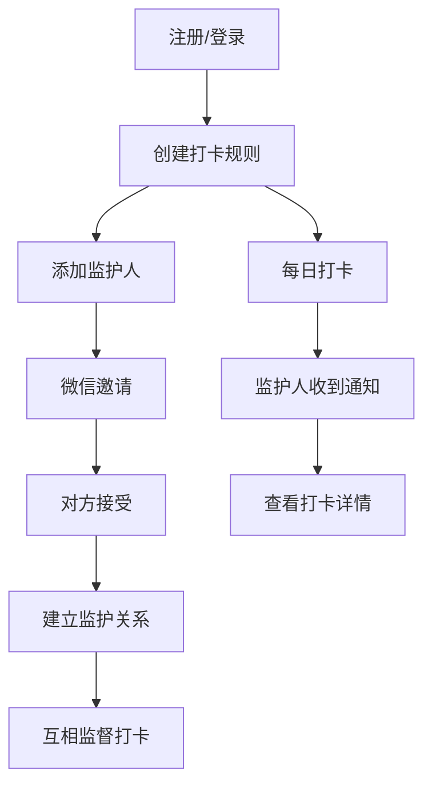

## 1. 产品概述
本项目是一个打卡管理应用，通过角色体系重构实现用户身份双重化，让用户同时具备打卡人和监护人身份。支持多对多监护关系建立，集成微信邀请功能，提供灵活的时间选择组件。

目标用户为需要互相监督完成打卡任务的个人和团体，通过监护机制提高打卡完成率和 accountability。

## 2. 核心功能

### 2.1 用户角色
| 角色 | 注册方式 | 核心权限 |
|------|----------|----------|
| 普通用户 | 微信授权注册 | 创建打卡规则、添加监护人、被监护、查看数据统计 |
| 社区人员 | 组织邀请注册 | 管理组织结构、查看组织内打卡数据（预留功能） |

### 2.2 功能模块
主要功能页面包括：
1. **打卡首页**：显示今日打卡任务、快捷打卡入口
2. **规则管理页**：创建/编辑打卡规则、管理监护人
3. **个人中心**：我的打卡记录、我监护的规则、设置
4. **邀请页面**：通过微信选择器邀请监护人

### 2.3 页面详情
| 页面名称 | 模块名称 | 功能描述 |
|----------|----------|----------|
| 打卡首页 | 今日任务 | 显示用户今日需要完成的所有打卡任务 |
| 打卡首页 | 快捷打卡 | 一键完成打卡，支持拍照/文字记录 |
| 规则管理页 | 规则列表 | 显示用户创建的所有打卡规则 |
| 规则管理页 | 添加规则 | 设置规则名称、打卡时间、重复周期 |
| 规则管理页 | 监护人管理 | 添加/删除监护人，显示当前监护人列表 |
| 个人中心 | 我的记录 | 查看历史打卡记录和统计图表 |
| 个人中心 | 监护规则 | 查看我作为监护人的所有规则 |
| 邀请页面 | 微信选择器 | 调用微信原生API选择联系人发送邀请 |
| 邀请页面 | 规则选择 | 多选需要监护的打卡规则 |

## 3. 核心流程

### 用户主要操作流程：
1. 用户注册登录后，可创建打卡规则
2. 在规则详情页点击"添加监护人"，选择要监护的规则
3. 通过微信选择器邀请好友成为监护人
4. 被邀请人接受后，建立监护关系
5. 监护人可查看被监护人的打卡情况

## 4. 用户界面设计

### 4.1 设计风格
- **主色调**：绿色系（代表健康、活力）
- **辅助色**：浅灰色、白色
- **按钮样式**：圆角矩形，渐变背景
- **字体**：系统默认字体，标题16px，正文14px
- **布局风格**：卡片式布局，上下分栏结构
- **图标风格**：线性图标，简洁现代

### 4.2 页面设计概览
| 页面名称 | 模块名称 | UI元素 |
|----------|----------|--------|
| 打卡首页 | 今日任务 | 卡片式任务列表，绿色完成按钮，灰色未完成状态 |
| 规则管理页 | 规则列表 | 横向滑动卡片，显示规则名称和下次打卡时间 |
| 规则管理页 | 监护人管理 | 头像+用户名列表，右侧删除按钮 |
| 邀请页面 | 规则选择 | 多选框列表，支持全选/取消全选 |
| 时间选择 | 预设时间 | 三个快捷按钮（08:00/12:00/19:00）+ 原生时间选择器 |

### 4.3 响应式设计
- **设计原则**：移动端优先
- **适配方案**：flexible布局，支持iPhone/Android各种屏幕尺寸
- **交互优化**：触摸区域不小于44px，支持滑动操作