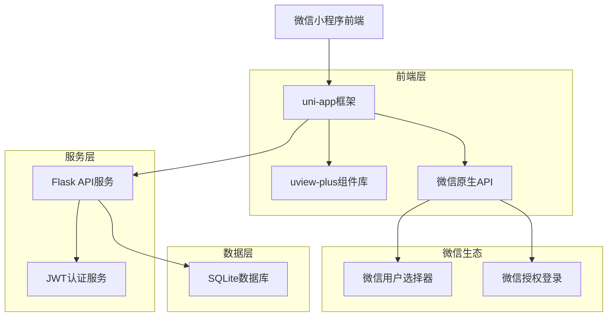
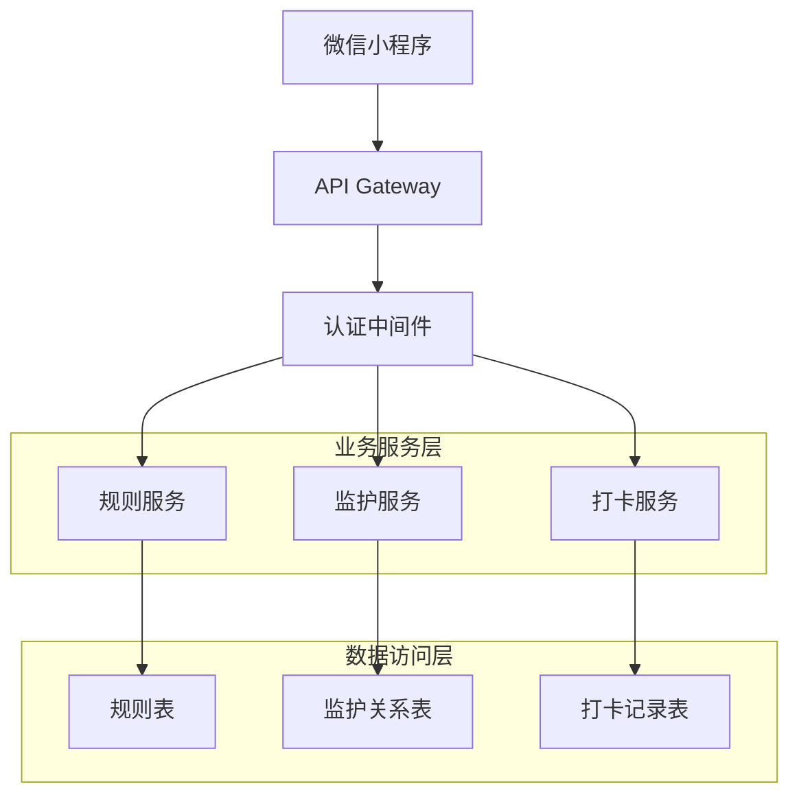
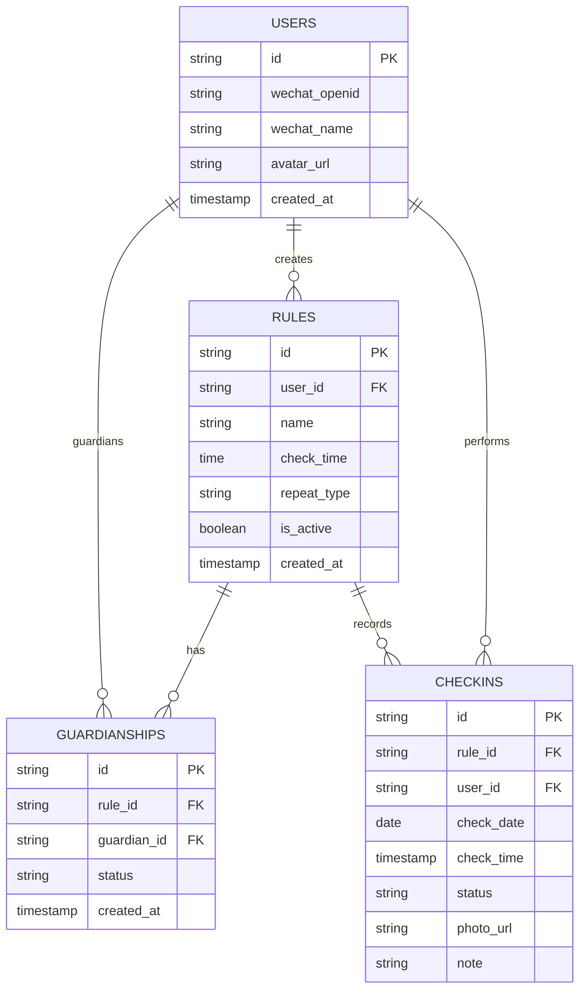

## 1. 架构设计



## 2. 技术描述

- **前端框架**：uni-app + Vue3 + uview-plus
- **初始化工具**：HBuilder X
- **后端服务**：Flask + Python + SQLite
- **认证方式**：JWT令牌认证
- **组件库**：uview-plus (时间选择器、表单组件)
- **微信API**：用户选择器、授权登录、消息推送

## 3. 路由定义

| 路由 | 用途 |
|------|------|
| /pages/index/index | 打卡首页，显示今日任务 |
| /pages/rules/list | 规则列表页面 |
| /pages/rules/detail | 规则详情和管理页面 |
| /pages/rules/create | 创建新规则页面 |
| /pages/invite/select | 微信邀请选择页面 |
| /pages/profile/index | 个人中心页面 |
| /pages/profile/guardian | 我监护的规则页面 |
| /pages/checkin/detail | 打卡详情页面 |

## 4. API定义

### 4.1 核心API

#### 打卡规则管理
```
POST /api/rules/create
```

请求参数：
| 参数名 | 类型 | 必填 | 描述 |
|--------|------|------|------|
| name | string | 是 | 规则名称 |
| check_time | string | 是 | 打卡时间 (HH:mm) |
| repeat_type | string | 是 | 重复类型 (daily/weekly/monthly) |
| description | string | 否 | 规则描述 |

响应示例：
```json
{
  "id": "rule_123",
  "name": "早起打卡",
  "check_time": "08:00",
  "status": "active"
}
```

#### 监护关系建立
```
POST /api/guardianship/create
```

请求参数：
| 参数名 | 类型 | 必填 | 描述 |
|--------|------|------|------|
| rule_ids | array | 是 | 规则ID数组 |
| guardian_wechat | string | 是 | 监护人微信用户名 |

响应示例：
```json
{
  "status": "pending",
  "invitation_code": "INV123456",
  "expires_at": "2024-12-31T23:59:59Z"
}
```

#### 获取监护规则
```
GET /api/guardian/rules
```

响应示例：
```json
{
  "rules": [
    {
      "id": "rule_123",
      "name": "早起打卡",
      "check_time": "08:00",
      "user_name": "张三",
      "today_status": "completed"
    }
  ]
}
```

## 5. 服务器架构图



## 6. 数据模型

### 6.1 数据模型定义



### 6.2 数据定义语言

#### 用户表 (users)
```sql
-- 创建用户表
CREATE TABLE users (
    id INTEGER PRIMARY KEY AUTOINCREMENT,
    wechat_openid VARCHAR(100) UNIQUE NOT NULL,
    wechat_name VARCHAR(100) NOT NULL,
    avatar_url TEXT,
    created_at TIMESTAMP DEFAULT CURRENT_TIMESTAMP
);

-- 创建索引
CREATE INDEX idx_users_wechat_openid ON users(wechat_openid);
```

#### 打卡规则表 (rules)
```sql
-- 创建规则表
CREATE TABLE rules (
    id INTEGER PRIMARY KEY AUTOINCREMENT,
    user_id INTEGER REFERENCES users(id) ON DELETE CASCADE,
    name VARCHAR(200) NOT NULL,
    check_time TIME NOT NULL,
    repeat_type VARCHAR(20) NOT NULL CHECK (repeat_type IN ('daily', 'weekly', 'monthly')),
    description TEXT,
    is_active BOOLEAN DEFAULT 1,
    created_at TIMESTAMP DEFAULT CURRENT_TIMESTAMP
);

-- 创建索引
CREATE INDEX idx_rules_user_id ON rules(user_id);
CREATE INDEX idx_rules_check_time ON rules(check_time);
```

#### 监护关系表 (rule_guardianships)
```sql
-- 创建监护关系表
CREATE TABLE rule_guardianships (
    id INTEGER PRIMARY KEY AUTOINCREMENT,
    rule_id INTEGER REFERENCES rules(id) ON DELETE CASCADE,
    guardian_id INTEGER REFERENCES users(id) ON DELETE CASCADE,
    status VARCHAR(20) DEFAULT 'pending' CHECK (status IN ('pending', 'accepted', 'rejected')),
    created_at TIMESTAMP DEFAULT CURRENT_TIMESTAMP,
    UNIQUE(rule_id, guardian_id)
);

-- 创建索引
CREATE INDEX idx_guardianships_rule_id ON rule_guardianships(rule_id);
CREATE INDEX idx_guardianships_guardian_id ON rule_guardianships(guardian_id);
```

#### 打卡记录表 (checkins)
```sql
-- 创建打卡记录表
CREATE TABLE checkins (
    id INTEGER PRIMARY KEY AUTOINCREMENT,
    rule_id INTEGER REFERENCES rules(id) ON DELETE CASCADE,
    user_id INTEGER REFERENCES users(id) ON DELETE CASCADE,
    check_date DATE NOT NULL,
    check_time TIMESTAMP,
    status VARCHAR(20) NOT NULL CHECK (status IN ('completed', 'missed', 'late')),
    photo_url TEXT,
    note TEXT,
    created_at TIMESTAMP DEFAULT CURRENT_TIMESTAMP
);

-- 创建索引
CREATE INDEX idx_checkins_rule_id ON checkins(rule_id);
CREATE INDEX idx_checkins_user_id ON checkins(user_id);
CREATE INDEX idx_checkins_check_date ON checkins(check_date);
```

### 6.3 权限配置

```python
# JWT认证配置
JWT_SECRET_KEY = "your-secret-key"
JWT_EXPIRATION_DELTA = timedelta(days=7)
JWT_ALGORITHM = "HS256"

# Flask权限装饰器示例
def login_required(f):
    @wraps(f)
    def decorated_function(*args, **kwargs):
        token = request.headers.get('Authorization')
        if not token:
            return jsonify({'code': -1, 'msg': '未提供认证令牌'}), 401
        
        try:
            payload = jwt.decode(token.split(' ')[1], JWT_SECRET_KEY, algorithms=[JWT_ALGORITHM])
            g.current_user_id = payload['user_id']
        except jwt.ExpiredSignatureError:
            return jsonify({'code': -1, 'msg': '令牌已过期'}), 401
        except jwt.InvalidTokenError:
            return jsonify({'code': -1, 'msg': '无效令牌'}), 401
        
        return f(*args, **kwargs)
    return decorated_function
```