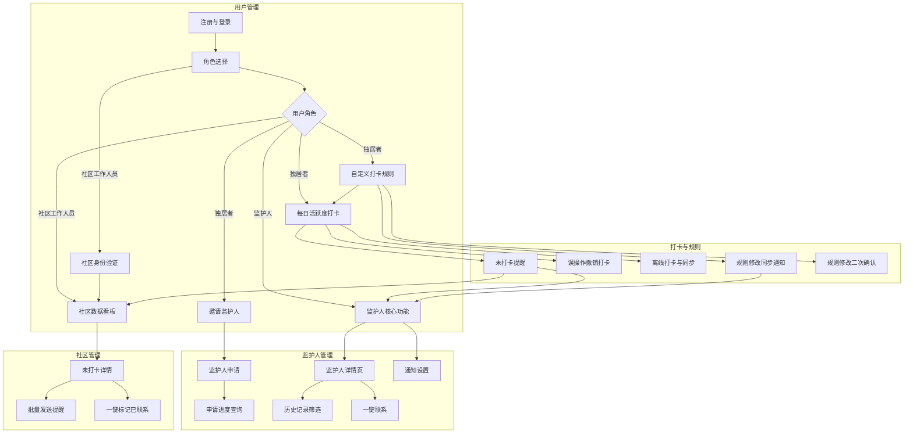

# 安全守护打卡小程序项目指南

## 项目概述

这是一个基于 uni-app + Vue3 开发的微信小程序，名为"安卡好习惯"，主要目标是为独居者提供安全监护服务。小程序通过日常打卡机制，让社区工作人员或亲友能够及时了解独居者的安全状况。

### 核心功能
- 用户每日活跃度打卡
- 自定义打卡规则设置
- 监护人邀请与管理系统
- 社区工作人员数据看板
- 多角色权限管理（独居者、监护人、社区工作人员）

### 目标用户群体
- 老年独居者
- 中年独居者
- 监护人（亲友）
- 社区工作人员

## 技术栈与架构

### 前端技术栈
- **框架**: uni-app + Vue3
- **状态管理**: Pinia
- **样式**: SCSS
- **类型检查**: TypeScript
- **UI组件库**: uview-plus（优先使用）和 uni-app 内置组件

### 项目结构
```
safeClockin/
├── api/                    # API接口目录（当前为空）
├── components/             # 公共组件目录（当前为空）
├── docs/                   # 项目文档
│   ├── PRD.md             # 产品需求文档
│   └── ui_reference/      # UI设计参考
├── pages/                  # 页面文件
│   └── index/             # 首页
├── static/                 # 静态资源
├── store/                  # Pinia状态管理（当前为空）
├── uni_modules/           # uni-app模块
├── App.vue                # 应用入口组件
├── main.js                # 应用入口文件
├── manifest.json          # 应用配置
├── pages.json             # 页面路由配置
└── uni.scss               # 全局样式
```

## 开发规范

### 组件使用原则
1. 优先使用 uview-plus 组件库
2. 其次使用 uni-app 内置组件和扩展组件
3. 如需使用其他组件库，必须先询问用户许可

### 代码规范
- 使用 Vue3 Composition API
- 使用 TypeScript 进行类型检查
- 使用 SCSS 编写样式
- 遵循 uni-app 开发规范

### 页面开发规范
根据 PRD.md 文档定义，项目包含以下主要页面：
- P-LOGIN: 登录页
- P-ROLE_SELECT: 角色选择页
- P-COMMUNITY_AUTH: 社区身份验证页
- P-HOME_SOLO: 独居者首页
- P-CHECKIN_LIST: 打卡事项列表页
- P-RULE_SETTING: 自定义打卡规则页
- P-ADD_RULE: 添加/编辑打卡规则页
- P-SUPERVISOR_MANAGE: 监护人管理页
- P-INVITE_SUPERVISOR: 邀请监护人页
- P-APPLY_SUPERVISOR: 申请监护人页
- P-HOME_SUPERVISOR: 监护人首页
- P-SUPERVISOR_DETAIL: 监护人详情页
- P-HOME_COMMUNITY: 社区数据看板页
- P-UNCHECKED_DETAIL: 未打卡独居者详情页
- P-PROFILE: 个人中心页
- P-NOTIFICATION_SETTINGS: 通知设置页

## 开发与构建

### 开发环境要求
- HBuilderX 或 CLI 开发工具
- Node.js 环境
- 微信开发者工具（用于小程序调试）

### 运行项目
1. 使用 HBuilderX 打开项目
2. 选择运行到微信小程序模拟器
3. 或使用命令行工具：`npm run dev:mp-weixin`

### 构建项目
1. 生产环境构建：`npm run build:mp-weixin`
2. 构建完成后在微信开发者工具中预览和上传

## 数据结构设计

### 核心数据表
- 用户表 (User)
- 社区表 (Community)
- 监督关系表 (SupervisionRelation)
- 打卡规则表 (CheckinRule)
- 打卡记录表 (CheckinRecord)
- 通知表 (Notification)

详细的数据结构设计请参考 `docs/PRD.md` 文档中的第4节。

## 功能模块关系



## 注意事项

1. **权限管理**: 不同角色有不同的功能权限，开发时需严格区分
2. **数据安全**: 用户敏感数据需加密存储和传输
3. **离线支持**: 独居者端需支持离线打卡功能
4. **实时同步**: 打卡数据和状态需保证实时更新
5. **UI设计**: 参考docs/ui_reference目录下的HTML文件进行界面开发

## 当前项目状态

项目处于初始化阶段，已完成：
- 基础项目结构搭建
- uni-app + Vue3 环境配置
- 微信小程序基础配置
- 产品需求文档和UI设计参考

待开发：
- 所有功能页面的实现
- API接口对接
- 状态管理实现
- 组件库集成

## 联系与支持

如需了解更多项目详情，请参考：
- 产品需求文档: `docs/PRD.md`
- UI设计参考: `docs/ui_reference/` 目录下的HTML文件
- uni-app官方文档: https://uniapp.dcloud.io/
- Vue3官方文档: https://v3.vuejs.org/
- uview-plus 官方文档: 