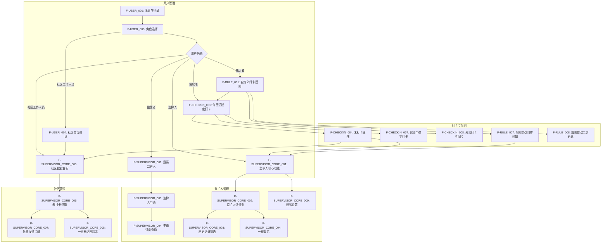
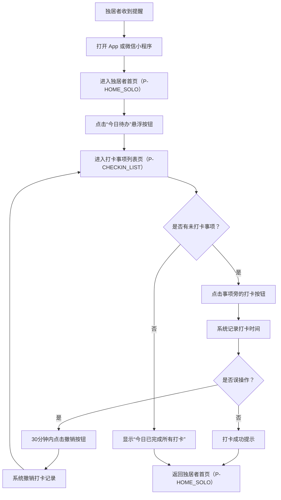
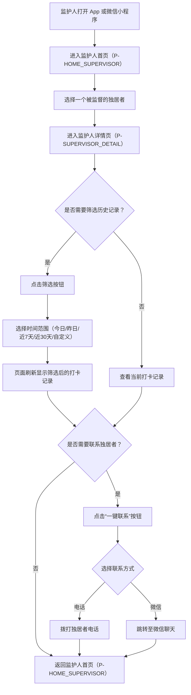
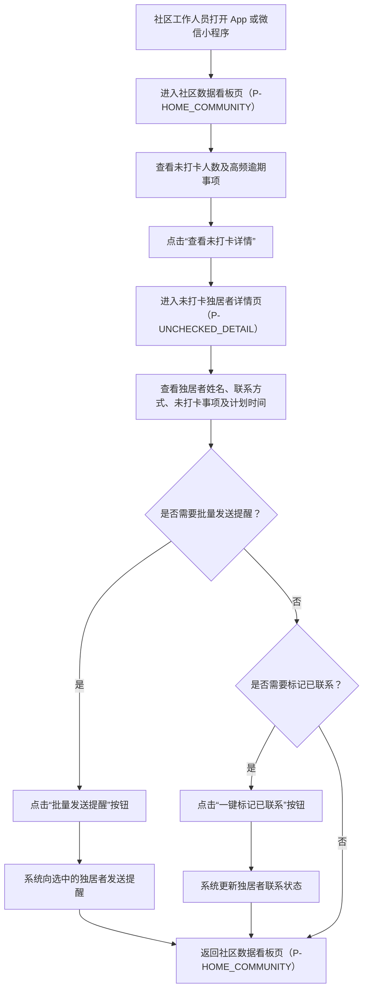
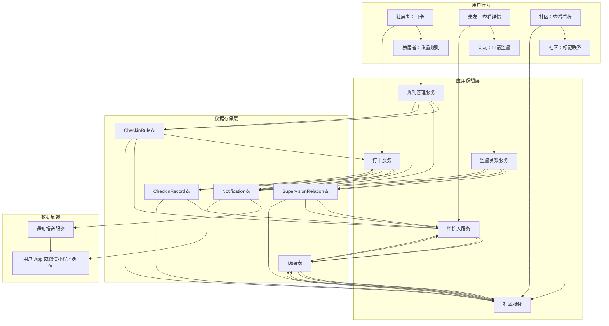

# 安全守护 App 或微信小程序产品需求文档

## 1. 产品概述

### 1.1 产品名称与定位

*   **产品名称:** 安全守护 (SafeGuardian)
*   **产品定位:** 一款轻量级安全监护移动应用，为独居者提供自主管理、监护人实时关注、社区高效服务的闭环解决方案。旨在通过简单的打卡机制，让监护人及时了解独居者的日常活动状况，保障其安全。

### 1.2 产品愿景与目标

*   **产品愿景:** 成为独居者安全监护领域的首选工具，构建一个连接独居者、亲友和社区的温暖守护网络，让每一位独居者都能安心生活，让关爱无处不在。
*   **产品目标:**
    *   提升独居者的自主生活能力和安全感。
    *   为监护人提供便捷、实时的独居者状态查询渠道。
    *   赋能社区工作人员，提高对辖区独居者的管理效率和应急响应速度。
    *   建立高效的独居者安全预警机制，降低意外风险。

### 1.3 产品使用终端

*   **终端类型:** 移动端 App 或微信小程序 (支持iOS和Android操作系统)

### 1.4 核心价值主张

*   **对独居者:** 提供简单易用的日常打卡工具，减少被遗忘的担忧，增强自我管理能力，同时获得亲友和社区的关注与支持。
*   **对监护人:** 实时掌握独居者的日常动态，及时发现潜在风险，减轻担忧，提供便捷的沟通渠道。
*   **对社区工作人员:** 高效管理辖区独居者信息，快速响应异常情况，提升社区服务质量和应急处理能力。

### 1.5 目标用户群体分析

*   **老年独居者:**
    *   **特征:** 操作能力较弱，对智能手机使用不熟练，视力、听力可能存在下降。
    *   **需求:** 极简的操作流程，清晰的界面和文字，大尺寸按钮，核心需求为轻松完成每日打卡、接收清晰的提醒。
*   **中年独居者:**
    *   **特征:** 具备一定的智能手机操作能力，对个人隐私和自主管理有较高要求。
    *   **需求:** 灵活设置打卡规则，自主管理监督关系，希望获得适度的关注而不被过度打扰。
*   **监护人:**
    *   **特征:** 关心独居者的日常安全，希望能及时了解其状况，但可能因工作或距离原因无法时刻陪伴。
    *   **需求:** 精准获取被监护人的打卡动态，包括完成情况和异常提醒，支持一键联系被监护人。
*   **社区工作人员:**
    *   **特征:** 负责辖区内独居者的整体管理和服务，需要高效的工具来批量掌握情况并进行干预。
    *   **需求:** 数据看板展示辖区独居者概况，快速筛选和查看未打卡人员，支持批量发送提醒和标记联系状态。

### 1.6 市场需求与竞品简析

*   **市场需求:** 随着人口老龄化加剧和独居生活方式的普及，独居者的安全监护问题日益突出。市场对简单、有效、多方参与的监护工具需求旺盛。传统监护方式（如定期上门探访）效率低下，无法实时掌握情况。现有部分竞品可能侧重于单一功能（如跌倒报警），或操作复杂，未能形成独居者、亲友、社区三方联动的闭环。
*   **竞品简析:**
    *   **传统监护设备:** 如智能手环、跌倒报警器等，功能单一，缺乏日常活动状态的全面反馈，且通常需要额外硬件成本。
    *   **部分健康管理 App 或微信小程序:** 可能包含部分健康打卡功能，但缺乏针对独居者安全的特定设计和监护人、社区角色的参与。
    *   **部分社区服务平台:** 可能提供信息登记，但缺乏实时互动和预警机制。
*   **本产品优势:** 安全守护 App 或微信小程序通过整合独居者自主打卡、亲友实时监督、社区高效管理于一体，形成了一个多方协作的闭环，操作简单，且无需额外硬件，降低了使用门槛，能更全面地满足市场需求。

## 2. 功能规格

### 2.1 功能详述

#### 2.1.1 注册与登录 (F-USER_001)

| 功能ID | 功能名称 | 功能描述 | 优先级 |
|--------|---------|---------|--------|
| F-USER_001 | 微信快捷登录 | 用户可通过微信授权快速登录 App 或微信小程序，无需手动输入账号密码。登录成功后，系统自动获取用户微信头像和昵称。 | P0 |
| F-USER_002 | 手机号登录 | 用户可通过手机号接收验证码进行登录。支持手机号+验证码登录方式。 | P1 |
| F-USER_003 | 角色选择 | 用户首次登录或切换角色时，需选择“独居者”或“社区工作人员”角色。 | P0 |
| F-USER_004 | 角色选择 | 用户首次登录或切换角色时，支持“监护人”，即：可以选择三个角色，分别是：“独居者”，“监护人”或“社区工作人员”。 | P1 |
| F-USER_005 | 社区工作人员身份验证 | 选择“社区工作人员”角色的用户，需额外提交工作证明或通过指定方式进行身份验证，验证通过后方可使用社区功能。 | P1 |

#### 2.1.2 每日活跃度打卡 (F-CHECKIN_001)

| 功能ID | 功能名称 | 功能描述 | 优先级 |
|--------|---------|---------|--------|
| F-CHECKIN_001 | 今日待办悬浮按钮 | 独居者首页顶部或显眼位置有“今日待办”悬浮按钮，点击进入打卡事项列表。 | P0 |
| F-CHECKIN_002 | 打卡事项列表展示 | 展示当日所有需要打卡的事项，每个事项旁有清晰的打卡按钮。 | P0 |
| F-CHECKIN_003 | 一键打卡 | 点击事项旁的打卡按钮，1步完成打卡操作，系统记录打卡时间。 | P0 |
| F-CHECKIN_004 | 未打卡提醒（独居者端） | 每日18:00对未完成打卡的独居者推送站内红点提醒，并发送短信提醒，短信内容包含未打卡事项的具体名称。 | P0 |
| F-CHECKIN_005 | 未打卡提醒（监护人端） | 当被监督的独居者有未打卡事项时，监护人将收到站内提醒。 | P1 |
| F-CHECKIN_006 | 未打卡提醒（社区端） | 社区工作人员在数据看板中可查看未打卡独居者数量及详情，并可对未打卡用户批量发送提醒。 | P0 |
| F-CHECKIN_007 | 误操作撤销打卡 | 独居者在打卡后30分钟内，可撤销误操作的打卡记录。 | P1 |
| F-CHECKIN_008 | 离线打卡与自动同步 | 网络中断时，打卡数据在本地缓存，待网络恢复后自动同步至服务器。 | P0 |

#### 2.1.3 自定义打卡规则 (F-RULE_001)

| 功能ID | 功能名称 | 功能描述 | 优先级 |
|--------|---------|---------|--------|
| F-RULE_001 | 默认打卡事项 | 系统提供预设的默认打卡事项分类及图标（如：起床、早餐、午餐、晚餐、服药、睡觉等）。 | P1 |
| F-RULE_002 | 自定义事项名称 | 独居者可自定义添加新的打卡事项名称。 | P0 |
| F-RULE_003 | 自定义事项图标 | 独居者可为自定义事项上传或选择图标。 | P0 |
| F-RULE_004 | 设置打卡频率 | 支持设置打卡事项的频率，如每天、每周指定天数等。 | P0 |
| F-RULE_005 | 设置打卡时间段 | 支持设置打卡事项的时间段，默认提供“上午/下午/晚上”选择，用户可选择精确到小时（最小时间单位为30分钟）。 | P0 |
| F-RULE_006 | 设置宽限期 | 系统固定为每个打卡事项提供30分钟的宽限期，允许在计划时间后30分钟内打卡仍视为有效。 | P0 |
| F-RULE_007 | 规则修改同步通知 | 当独居者修改打卡规则后，系统自动向其所有监护人推送通知，告知规则已更新。 | P1 |
| F-RULE_008 | 规则修改二次确认 | 独居者修改已设置的打卡规则后，系统弹出确认弹窗，需用户二次确认后方可保存修改。 | P1 |

#### 2.1.4 邀请与申请监护人 (F-SUPERVISOR_001)

| 功能ID | 功能名称 | 功能描述 | 优先级 |
|--------|---------|---------|--------|
| F-SUPERVISOR_001 | 微信好友分享邀请 | 独居者可通过微信好友分享链接或二维码邀请亲友成为监护人。 | P0 |
| F-SUPERVISOR_002 | 手机号邀请 | 独居者可通过输入手机号邀请亲友成为监护人。 | P1 |
| F-SUPERVISOR_003 | 监护人申请 | 监护人可主动申请成为某个独居者的监护人，提交申请后等待独居者同意。 | P1 |
| F-SUPERVISOR_004 | 申请进度查询 | 监护人可在 App 或微信小程序内查询其提交的监护人申请的当前状态（待同意、已同意、已拒绝）。 | P0 |

#### 2.1.5 监护人核心功能 (F-SUPERVISOR_CORE_001)

| 功能ID | 功能名称 | 功能描述 | 优先级 |
|--------|---------|---------|--------|
| F-SUPERVISOR_CORE_001 | 监护人首页概况 | 监护人首页展示其所监督的独居者列表，每个独居者显示今日打卡概况（如：已打卡/未打卡数量）。 | P0 |
| F-SUPERVISOR_CORE_002 | 监护人详情页 | 点击独居者列表项进入详情页，按日期倒序查看被监护人每日的打卡详情，包括“事项名称、打卡时间、状态（已打卡/未打卡）”。 | P0 |
| F-SUPERVISOR_CORE_003 | 历史打卡记录筛选 | 监护人在详情页可按“今日、昨日、近7天、近30天、自定义日期范围”筛选查看历史打卡记录。 | P0 |
| F-SUPERVISOR_CORE_004 | 一键联系独居者 | 监护人在详情页可一键拨打独居者电话或跳转至微信聊天界面。 | P0 |
| F-SUPERVISOR_CORE_005 | 社区数据看板 | 社区工作人员首页展示辖区独居者总数、今日打卡率、未打卡人数及高频逾期事项TOP3。 | P0 |
| F-SUPERVISOR_CORE_006 | 未打卡独居者详情 | 社区工作人员可查看未打卡独居者的详细信息，包括姓名、联系方式、未打卡事项的具体内容及计划打卡时间。 | P0 |
| F-SUPERVISOR_CORE_007 | 批量发送提醒 | 社区工作人员可对未打卡独居者批量发送提醒通知。 | P0 |
| F-SUPERVISOR_CORE_008 | 一键标记已联系 | 社区工作人员在查看未打卡独居者详情时，可一键标记该独居者已联系状态。 | P1 |
| F-SUPERVISOR_CORE_009 | 监护人通知设置 | 监护人可自主设置是否接收被监护人完成打卡的通知。 | P0 |

### 2.2 功能模块间的关系图

## 3. 用户流程

### 3.1 用户旅程地图

| 阶段 | 用户角色 | 目标 | 行为 | 触点 | 痛点 | 解决方案 | 情感 |
|---|---|---|---|---|---|---|---|
| **注册/登录** | 独居者/亲友/社区 | 首次使用 App 或微信小程序 | 下载 App 或微信小程序 -> 微信/手机号登录 -> 选择角色 -> （社区）身份验证 |  App 或微信小程序下载页、登录页、角色选择页、身份验证页 | 注册流程复杂、角色选择不明确、社区身份验证繁琐 | 微信快捷登录、清晰角色引导、简化验证流程 | 期待 -> 便捷 -> 安心 |
| **设置打卡规则** | 独居者 | 定制个性化打卡计划 | 进入规则设置页 -> 添加/编辑事项 -> 设置频率/时间 -> 保存 | 自定义打卡规则页 | 规则设置复杂、选项不清晰 | 提供默认事项、可视化设置、二次确认 | 困惑 -> 掌控 -> 满意 |
| **每日打卡** | 独居者 | 完成日常打卡 | 收到提醒 -> 打开 App 或微信小程序 -> 点击“今日待办” -> 点击打卡按钮 | 首页、打卡事项列表页、短信提醒 | 忘记打卡、操作步骤多、误操作 | 显眼提醒、一键打卡、误操作撤销 | 遗忘 -> 轻松 -> 成就感 |
| **查看状态** | 监护人 | 了解独居者情况 | 打开 App 或微信小程序 -> 查看首页概况 -> 点击进入详情页 -> 筛选历史记录 | 监护人首页、监护人详情页 | 信息不全面、无法追溯历史、联系不便 | 实时概况、详细记录、一键联系 | 担忧 -> 放心 -> 安心 |
| **管理与干预** | 社区工作人员 | 掌握辖区情况并处理异常 | 打开 App 或微信小程序 -> 查看数据看板 -> 筛选未打卡人员 -> 查看详情 -> 批量提醒/标记联系 | 社区数据看板页、未打卡独居者详情页 | 数据不直观、无法快速定位问题、处理效率低 | 直观数据看板、详细未打卡信息、批量操作 | 焦虑 -> 高效 -> 责任 |

### 3.2 关键路径流程图

#### 3.2.1 独居者每日打卡流程

#### 3.2.2 监护人查看被监护人详情流程

#### 3.2.3 社区工作人员处理未打卡独居者流程

### 3.3 各场景下的用户操作步骤

#### 3.3.1 独居者注册与首次登录

1.  **用户操作:** 下载并安装“安全守护” App 或微信小程序。
2.  **用户操作:** 打开 App 或微信小程序，点击“微信快捷登录”按钮。
3.  **系统反馈:** 弹出微信授权弹窗。
4.  **用户操作:** 确认微信授权。
5.  **系统反馈:** 登录成功，跳转至角色选择页（P-ROLE_SELECT）。
6.  **用户操作:** 选择“独居者”角色。
7.  **系统反馈:** 跳转至独居者首页（P-HOME_SOLO）。

#### 3.3.2 独居者自定义打卡规则

1.  **用户操作:** 在独居者首页（P-HOME_SOLO）点击“个人中心”入口。
2.  **系统反馈:** 跳转至个人中心页（P-PROFILE）。
3.  **用户操作:** 点击“自定义打卡规则”入口。
4.  **系统反馈:** 跳转至自定义打卡规则页（P-RULE_SETTING）。
5.  **用户操作:** 点击“添加事项”按钮。
6.  **系统反馈:** 弹出添加事项弹窗或跳转至添加事项页。
7.  **用户操作:** 输入事项名称，选择图标，设置频率（如“每天”），设置时间段（如“上午”或精确到“9:00-9:30”）。
8.  **用户操作:** 点击“保存”按钮。
9.  **系统反馈:** 弹出二次确认弹窗。
10. **用户操作:** 点击“确认”按钮。
11. **系统反馈:** 事项添加成功，页面刷新显示新事项，同时向所有监护人发送规则更新通知。

#### 3.3.3 监护人申请成为监护人

1.  **用户操作:** 在监护人首页（P-HOME_SUPERVISOR）点击“申请成为监护人”入口。
2.  **系统反馈:** 跳转至申请监护人页（P- App 或微信小程序LY_SUPERVISOR）。
3.  **用户操作:** 输入被监督独居者的手机号或通过微信搜索。
4.  **用户操作:** 点击“提交申请”按钮。
5.  **系统反馈:** 申请提交成功提示，显示申请进度（待同意）。
6.  **独居者操作:** 收到监护人申请通知，在监护人管理页（P-SUPERVISOR_MANAGE）点击“同意”。
7.  **系统反馈:** 监护人收到申请通过通知，被监督独居者出现在监护人首页（P-HOME_SUPERVISOR）的列表中。

## 4. 数据流设计

### 4.1 数据结构与关系

*   **用户表 (User)**
    *   `user_id` (PK)
    *   `wechat_openid` (Unique)
    *   `phone_number` (Unique)
    *   `nickname`
    *   `avatar_url`
    *   `role` (独居者/监护人/社区工作人员)
    *   `community_id` (FK, 仅社区工作人员)
    *   `status` (正常/禁用)
    *   `created_at`
    *   `updated_at`

*   **社区表 (Community)**
    *   `community_id` (PK)
    *   `community_name`
    *   `address`
    *   `contact_person`
    *   `contact_phone`
    *   `created_at`
    *   `updated_at`

*   **监督关系表 (SupervisionRelation)**
    *   `relation_id` (PK)
    *   `solo_user_id` (FK, 独居者ID)
    *   `supervisor_user_id` (FK, 监护人ID)
    *   `status` (待同意/已同意/已拒绝)
    *   `created_at`
    *   `updated_at`

*   **打卡规则表 (CheckinRule)**
    *   `rule_id` (PK)
    *   `solo_user_id` (FK)
    *   `rule_name`
    *   `icon_url`
    *   `frequency_type` (每天/每周/自定义)
    *   `frequency_details` (JSON, 如每周几)
    *   `time_slot_type` (时段/精确时间)
    *   `time_slot_details` (JSON, 如上午/下午/晚上或具体时间段)
    *   `grace_period_minutes` (宽限期，固定30分钟)
    *   `is_active` (是否启用)
    *   `created_at`
    *   `updated_at`

*   **打卡记录表 (CheckinRecord)**
    *   `record_id` (PK)
    *   `solo_user_id` (FK)
    *   `rule_id` (FK)
    *   `checkin_time` (实际打卡时间)
    *   `status` (已打卡/未打卡/已撤销)
    *   `created_at`
    *   `updated_at`

*   **通知表 (Notification)**
    *   `notification_id` (PK)
    *   `user_id` (FK, 接收通知的用户ID)
    *   `type` (未打卡提醒/规则更新/监护人申请/系统通知)
    *   `content`
    *   `related_id` (关联的记录ID，如打卡记录ID、规则ID、监督关系ID)
    *   `is_read` (是否已读)
    *   `created_at`

### 4.2 关键数据流向图

### 4.3 数据存储与处理原则

1.  **数据安全:** 所有用户敏感数据（如手机号、微信OpenID）进行加密存储和传输。遵循最小权限原则，仅授权必要人员访问数据。
2.  **数据一致性:** 采用事务机制确保打卡记录、规则更新、监督关系变更等操作的数据一致性。
3.  **数据实时性:** 打卡数据、未打卡状态、监督关系状态等关键信息需保证实时更新和同步，确保监护人和社区能及时获取最新状态。
4.  **数据可追溯性:** 所有关键操作（如打卡、撤销、规则修改、监督关系变更）均记录操作日志，便于问题排查和审计。
5.  **数据备份与恢复:** 定期对数据库进行全量和增量备份，制定完善的数据恢复策略，确保数据安全和业务连续性。
6.  **离线缓存:** 独居者端支持离线打卡，打卡数据在本地缓存，待网络恢复后自动同步至服务器，确保数据不丢失。
7.  **隐私保护:** 严格遵守用户隐私相关法律法规，未经用户明确授权，不得泄露其个人信息。社区工作人员查看独居者联系方式需符合权限管理。

## 5. 页面规格

### 5.1 页面概览

| 页面ID | 页面名称 | 核心功能 |
|--------|---------|---------|
| P-LOGIN | 登录页 | 用户登录（微信/手机号） |
| P-ROLE_SELECT | 角色选择页 | 用户选择注册/登录角色 |
| P-COMMUNITY_AUTH | 社区身份验证页 | 社区工作人员身份验证 |
| P-HOME_SOLO | 独居者首页 | 展示今日待办、快捷打卡入口 |
| P-CHECKIN_LIST | 打卡事项列表页 | 展示并完成每日打卡事项 |
| P-RULE_SETTING | 自定义打卡规则页 | 添加、编辑、删除打卡规则 |
| P-ADD_RULE | 添加/编辑打卡规则页 | 具体设置打卡规则详情 |
| P-SUPERVISOR_MANAGE | 监护人管理页 | 独居者管理监护人列表 |
| P-INVITE_SUPERVISOR | 邀请监护人页 | 独居者邀请亲友成为监护人 |
| P- App 或微信小程序LY_SUPERVISOR | 申请监护人页 | 亲友申请成为监护人 |
| P-HOME_SUPERVISOR | 监护人首页 | 展示被监督独居者概况 |
| P-SUPERVISOR_DETAIL | 监护人详情页 | 查看被监督独居者打卡详情 |
| P-HOME_COMMUNITY | 社区数据看板页 | 展示辖区独居者数据概览 |
| P-UNCHECKED_DETAIL | 未打卡独居者详情页 | 社区查看未打卡独居者详细信息 |
| P-PROFILE | 个人中心页 | 用户个人信息及功能入口 |
| P-NOTIFICATION_SETTINGS | 通知设置页 | 监护人设置通知偏好 |

### 5.2 页面详情

#### 5.2.1 登录页（P-LOGIN）

*   **页面名称与目的:** 登录页，提供用户进入 App 或微信小程序的入口，支持多种登录方式。
*   **页面负责的核心功能:** 用户身份验证。
*   **主要UI元素与布局建议:**
    *    App 或微信小程序 Logo及名称。
    *   “微信快捷登录”按钮（大尺寸，居中）。
    *   “手机号登录”入口（文字链接或按钮）。
    *   用户协议与隐私政策链接。
*   **页面需展示的关键数据:** 无。

#### 5.2.2 角色选择页（P-ROLE_SELECT）

*   **页面名称与目的:** 角色选择页，引导用户选择其在 App 或微信小程序中的身份角色。
*   **页面负责的核心功能:** 用户角色分配。
*   **主要UI元素与布局建议:**
    *   页面标题：“请选择您的角色”。
    *   三个角色选择卡片/按钮：
        *   “独居者”（包含老年/中年选项，或根据注册信息自动判断）。
        *   “监护人”。
        *   “社区工作人员”。
    *   每个角色下方有简要说明。
*   **页面需展示的关键数据:** 无。

#### 5.2.3 社区身份验证页（P-COMMUNITY_AUTH）

*   **页面名称与目的:** 社区身份验证页，用于验证用户是否具备社区工作人员身份。
*   **页面负责的核心功能:** 社区工作人员身份认证。
*   **主要UI元素与布局建议:**
    *   页面标题：“社区工作人员身份验证”。
    *   输入框：姓名、工号/身份证号。
    *   上传图片区域：用于上传工作证明照片。
    *   “提交验证”按钮。
*   **页面需展示的关键数据:** 无。

#### 5.2.4 独居者首页（P-HOME_SOLO）

*   **页面名称与目的:** 独居者首页，提供今日待办事项概览和快捷打卡入口。
*   **页面负责的核心功能:** 展示待办、快捷打卡。
*   **主要UI元素与布局建议:**
    *   顶部：用户头像、昵称、问候语。
    *   中部：“今日待办”悬浮按钮（大尺寸，醒目），显示今日待打卡事项数量。
    *   下方：已完成打卡事项列表（可选）。
    *   底部导航栏：首页、个人中心。
*   **页面需展示的关键数据:**
    *   用户头像、昵称。
    *   今日待打卡事项数量。
    *   已完成打卡事项列表（事项名称、打卡时间）。

#### 5.2.5 打卡事项列表页（P-CHECKIN_LIST）

*   **页面名称与目的:** 打卡事项列表页，展示独居者当日所有待打卡事项，并提供打卡操作。
*   **页面负责的核心功能:** 展示待打卡事项、执行打卡、撤销打卡。
*   **主要UI元素与布局建议:**
    *   页面标题：“今日待办”。
    *   事项列表：每个事项包含图标、名称、计划时间、打卡按钮。
    *   已完成事项显示已打卡时间。
    *   撤销按钮（仅在打卡后30分钟内显示）。
*   **页面需展示的关键数据:**
    *   当日所有待打卡事项的名称、图标、计划时间。
    *   已打卡事项的实际打卡时间。

#### 5.2.6 自定义打卡规则页（P-RULE_SETTING）

*   **页面名称与目的:** 自定义打卡规则页，允许独居者管理其日常打卡事项的规则。
*   **页面负责的核心功能:** 添加、编辑、删除打卡规则。
*   **主要UI元素与布局建议:**
    *   页面标题：“自定义打卡规则”。
    *   已设置规则列表：每个规则显示名称、图标、频率、时间。
    *   “添加事项”按钮（悬浮或底部固定）。
    *   编辑/删除按钮（在每个规则项上）。
*   **页面需展示的关键数据:**
    *   所有已设置的打卡规则列表。

#### 5.2.7 添加/编辑打卡规则页（P-ADD_RULE）

*   **页面名称与目的:** 添加/编辑打卡规则页，用于设置或修改单个打卡事项的详细规则。
*   **页面负责的核心功能:** 设置打卡事项名称、图标、频率、时间段、宽限期。
*   **主要UI元素与布局建议:**
    *   页面标题：“添加事项”或“编辑事项”。
    *   输入框：事项名称。
    *   图标选择器：预设图标列表，支持上传自定义图标。
    *   频率选择器：单选（每天、每周、自定义）。
    *   时间选择器：
        *   默认提供“上午/下午/晚上”选择。
        *   可切换至精确时间选择器（最小单位30分钟）。
    *   “保存”按钮。
*   **页面需展示的关键数据:**
    *   （编辑模式下）当前规则的名称、图标、频率、时间设置。

#### 5.2.8 监护人管理页（P-SUPERVISOR_MANAGE）

*   **页面名称与目的:** 监护人管理页，独居者可查看和管理其监护人列表。
*   **页面负责的核心功能:** 查看监护人列表、处理监护人申请、移除监护人。
*   **主要UI元素与布局建议:**
    *   页面标题：“我的监护人”。
    *   监护人列表：显示已同意的监护人头像、昵称、关系。
    *   待处理申请列表：显示待同意的监护人申请，包含“同意”/“拒绝”按钮。
    *   “邀请监护人”按钮。
*   **页面需展示的关键数据:**
    *   已同意的监护人列表。
    *   待处理的监护人申请列表。

#### 5.2.9 邀请监护人页（P-INVITE_SUPERVISOR）

*   **页面名称与目的:** 邀请监护人页，独居者可通过多种方式邀请亲友成为其监护人。
*   **页面负责的核心功能:** 生成邀请链接/二维码、通过手机号邀请。
*   **主要UI元素与布局建议:**
    *   页面标题：“邀请监护人”。
    *   “微信好友分享”按钮：点击生成分享卡片或二维码。
    *   “通过手机号邀请”区域：输入框（手机号）、“发送邀请”按钮。
*   **页面需展示的关键数据:** 无。

#### 5.2.10 申请监护人页（P- App 或微信小程序LY_SUPERVISOR）

*   **页面名称与目的:** 申请监护人页，监护人可主动申请成为某个独居者的监护人。
*   **页面负责的核心功能:** 提交监护人申请。
*   **主要UI元素与布局建议:**
    *   页面标题：“申请成为监护人”。
    *   输入框：被监督独居者的手机号或微信昵称。
    *   “提交申请”按钮。
    *   申请进度显示区域（可选）。
*   **页面需展示的关键数据:**
    *   （可选）当前用户提交的申请列表及状态。

#### 5.2.11 监护人首页（P-HOME_SUPERVISOR）

*   **页面名称与目的:** 监护人首页，展示其所监督的独居者列表及今日打卡概况。
*   **页面负责的核心功能:** 概览被监督独居者状态。
*   **主要UI元素与布局建议:**
    *   顶部：用户头像、昵称。
    *   中部：被监督独居者列表，每个列表项显示独居者头像、昵称、今日打卡概况（如：已打卡X项/未打卡Y项）。
    *   “申请成为监护人”入口。
    *   底部导航栏：首页、个人中心。
*   **页面需展示的关键数据:**
    *   被监督独居者列表。
    *   每个独居者的今日打卡完成情况。

#### 5.2.12 监护人详情页（P-SUPERVISOR_DETAIL）

*   **页面名称与目的:** 监护人详情页，监护人可查看被监督独居者的详细打卡记录。
*   **页面负责的核心功能:** 查看历史打卡记录、筛选记录、一键联系。
*   **主要UI元素与布局建议:**
    *   页面标题：被监督独居者昵称。
    *   顶部：被监督独居者头像、昵称、今日打卡概况。
    *   “一键联系”按钮（电话/微信）。
    *   时间筛选器：今日、昨日、近7天、近30天、自定义日期范围。
    *   打卡记录列表：按日期倒序排列，每项显示事项名称、计划时间、实际打卡时间、状态（已打卡/未打卡）。
*   **页面需展示的关键数据:**
    *   被监督独居者的头像、昵称。
    *   被监督独居者的今日打卡概况。
    *   历史打卡记录列表（事项名称、计划时间、实际打卡时间、状态）。

#### 5.2.13 社区数据看板页（P-HOME_COMMUNITY）

*   **页面名称与目的:** 社区数据看板页，社区工作人员可查看辖区独居者的整体数据概览。
*   **页面负责的核心功能:** 展示辖区独居者总数、今日打卡率、未打卡人数、高频逾期事项。
*   **主要UI元素与布局建议:**
    *   顶部：社区名称、工作人员姓名。
    *   数据卡片：辖区独居者总数、今日打卡率、未打卡人数。
    *   图表：高频逾期事项TOP3（柱状图或列表）。
    *   “查看未打卡详情”按钮。
    *   底部导航栏：首页、个人中心。
*   **页面需展示的关键数据:**
    *   辖区独居者总数。
    *   今日打卡率。
    *   未打卡人数。
    *   高频逾期事项TOP3列表。

#### 5.2.14 未打卡独居者详情页（P-UNCHECKED_DETAIL）

*   **页面名称与目的:** 未打卡独居者详情页，社区工作人员可查看辖区内所有未打卡独居者的详细信息。
*   **页面负责的核心功能:** 展示未打卡独居者列表、查看具体未打卡事项、批量发送提醒、标记已联系。
*   **主要UI元素与布局建议:**
    *   页面标题：“未打卡独居者详情”。
    *   未打卡独居者列表：每个列表项显示独居者姓名、联系方式、未打卡事项数量。
    *   点击列表项展开：显示该独居者未打卡事项的具体内容及计划打卡时间。
    *   “批量发送提醒”按钮。
    *   “一键标记已联系”按钮（在展开项中）。
*   **页面需展示的关键数据:**
    *   未打卡独居者列表（姓名、联系方式）。
    *   每个未打卡独居者的未打卡事项列表（事项名称、计划打卡时间）。

#### 5.2.15 个人中心页（P-PROFILE）

*   **页面名称与目的:** 个人中心页，提供用户个人信息展示和各项功能入口。
*   **页面负责的核心功能:** 用户信息管理、功能导航。
*   **主要UI元素与布局建议:**
    *   顶部：用户头像、昵称、角色。
    *   功能列表：
        *   （独居者）自定义打卡规则、监护人管理。
        *   （监护人）通知设置。
        *   （通用）关于我们、退出登录。
*   **页面需展示的关键数据:**
    *   用户头像、昵称、角色。

#### 5.2.16 通知设置页（P-NOTIFICATION_SETTINGS）

*   **页面名称与目的:** 通知设置页，监护人可设置是否接收被监护人完成打卡的通知。
*   **页面负责的核心功能:** 管理通知偏好。
*   **主要UI元素与布局建议:**
    *   页面标题：“通知设置”。
    *   开关：“接收被监护人完成打卡通知”（开启/关闭）。
*   **页面需展示的关键数据:**
    *   当前通知设置状态。

